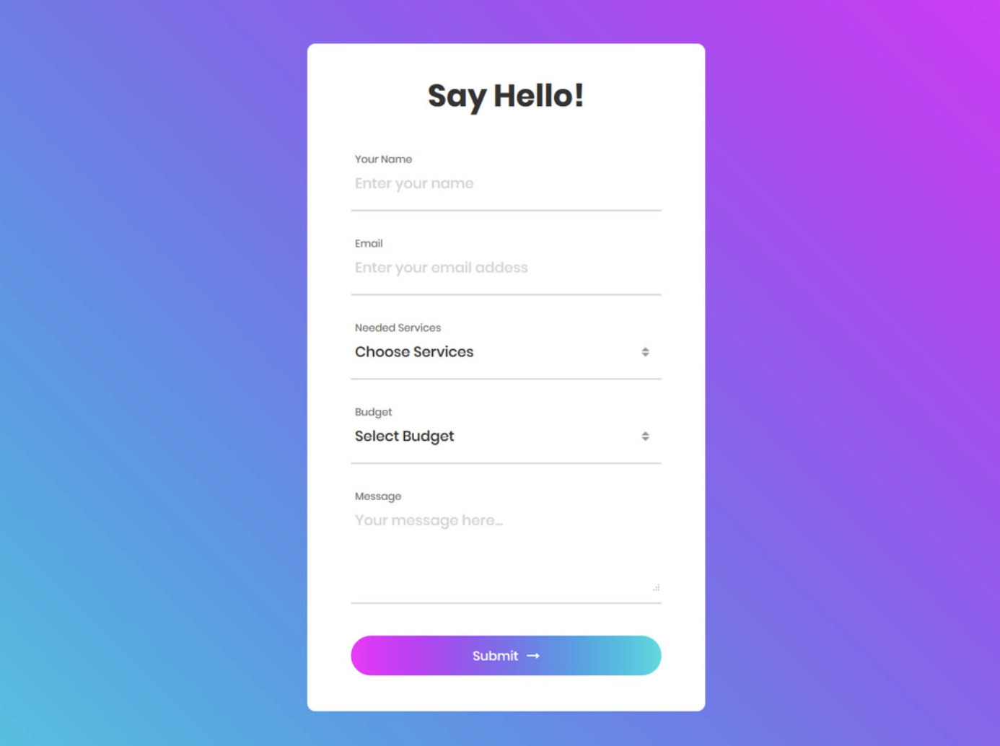

# Stylish Form
Today we're building a lovely form for customer enquiries. Forms are not the easiest elements to style, so you might want to take your time to get it right! The end result should look as close as possible to the below:

## Instructions
- Replicate this form the closest you can
- The form should sit in the middle of the page 
- Add validation to it

## Tips
- How can we do gradients?
- Not everything you will be asked to do you will have seen before, so sharpen those Google Fu skills!

## Challenge 1
Add animations and styling for valid/invalid inputs

## Challenge 2
Once the form is submitted successfully, take the user to a similarly styled "Thank you" page